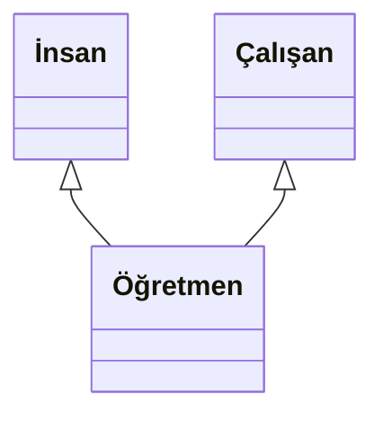

# Multiple Inheritance
Bir sınıfın 2 veya daha fazla taban sınıftan türetilmesine Multiple Inheritance denmektedir. Aşağıdaki örnekte verildiği gibi öğretmen sınıfı insan ve çalışan sınıflarından türetilmektedir.

## İnsan Sınıfı İmplementasyonu
İnsanların ortak özelliklerini temsil eden bir taban sınıf (base class) yazın. Bu sınıfın aşağıdaki gibi temel fonksiyonları olsun.
<pre>
* Yürüme      --> Yavaş, Normal, Hızlı
* Koşma       --> Yavaş, Normal, Hızlı
* Konuşma     --> Yavaş, Normal, Hızlı
* Yeme        --> Yavaş, Normal, Hızlı
* Uyuma       --> Az,    Normal, Çok
* Kitap Okuma --> Yavaş, Normal, Hızlı
</pre>
* İstenen ekstra özellikler eklenebilir.

## Çalışan Sınıfı İmplementasyonu
Çalışanların ortak özelliklerini temsil eden bir taban sınıf (base class) yazın. Bu sınıfın aşağıdaki gibi temel fonksiyonları olsun.
<pre>
* Maaş
* Çalışma Süresi
* Vardiya Düzeni
</pre>
* İstenen ekstra özellikler eklenebilir.

## Öğretmen Sınıfı İmplementasyonu
İnsan ve çalışan sınıflarının tüm özelliklerini barındırır. Bu özelliklerden bazılarının default değerlerini değiştirir (override eder).
* Bunlara ek olarak öğretme özelliği vardır.
* İstenen ekstra özellikler eklenebilir.

## Ödev Teslimi

Ödevi derse katılan herkes kendisi için açılmış olan klasörlere yüklemelidir. **Ödev Teslim Tarihi: 11.03.2020**