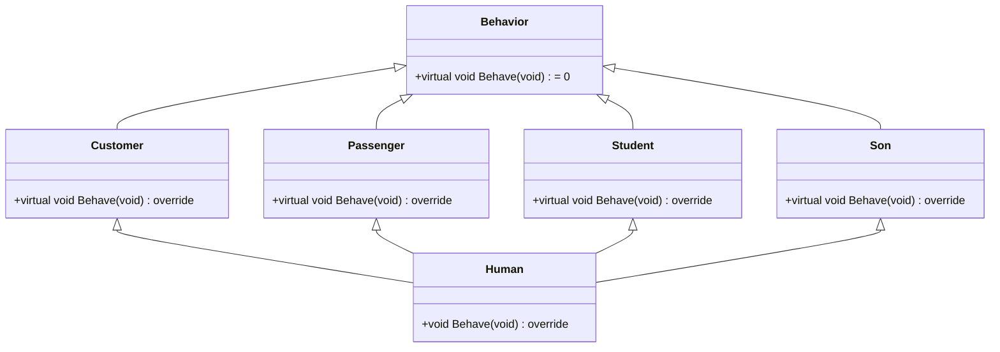

# Polymorphism
Tipik olarak çok biçimlilik (Polymorphism) birçok sınıfın bulunduğu bir sınıf hiyerarşisi içerisinde, sınıflar arasında kalıtım (inheritence) yoluyla ortaya çıkan ilişki içerisinde gözlemlenebilir.

**"static resolution"**, **"static linkage"** ve **"early binding"** kelimelerinin anlamları nelerdir? Araştırın. Anladıklarınızı **Türkçe** olarak ödevle ilgili kendi klasörünüz içerisindeki README.md dosyasının içerisine yazın.

**"dynamic linkage"** or **"late binding"** kelimelerinin anlamları nelerdir? Araştırın. Anladıklarınızı **Türkçe** olarak ödevle ilgili kendi klasörünüz içerisindeki README.md dosyasının içerisine yazın.

**"virtual function"** ve **"pure virtual function"** kelimelerinin anlamları nelerdir? Araştırın. Anladıklarınızı **Türkçe** olarak ödevle ilgili kendi klasörünüz içerisindeki README.md dosyasının içerisine yazın.

Bir sınıfın 2 veya daha fazla taban sınıftan türetilmesine Multiple Inheritance denmektedir. Aşağıdaki örnekte verildiği gibi insan sınıfı müşteri, yolcu, öğrenci ve oğul sınıflarından türetilmektedir.

Her taban sınıfın kendi özellikleri vardır. Bu özellikler aşağıdaki gibidir.

## Davranış Sınıfı İmplementasyonu
Bu sınıf tamamen abstract olan bir sınıftır. Bu sınıfın aşağıdaki gibi temel fonksiyonları olsun.
<pre>
* Geri dönüş değeri ve parametresi olmayan Behave fonksiyonu bulunmaktadır.
* virtual void Behave(void) = 0;
</pre>
* İstenen ekstra özellikler eklenebilir.

## Müşteri Sınıfı İmplementasyonu
Davranış sınıfından türetilmiştir. Müşterilerin ortak özelliklerini temsil eden bir taban sınıf (base class) yazın. Bu sınıfın aşağıdaki gibi temel fonksiyonları olsun.
<pre>
* Geri dönüş değeri ve parametresi olmayan Behave fonksiyonu bulunmaktadır.
* virtual void Behave(void) override;
* Fonksiyon çağrıldığında ekrana müşteri gibi davranıldığını gösteren bir ifade yazılmalıdır.
</pre>
* İstenen ekstra özellikler eklenebilir.

## Yolcu Sınıfı İmplementasyonu
Davranış sınıfından türetilmiştir. Yolcuların ortak özelliklerini temsil eden bir taban sınıf (base class) yazın. Bu sınıfın aşağıdaki gibi temel fonksiyonları olsun.
<pre>
* Geri dönüş değeri ve parametresi olmayan Behave fonksiyonu bulunmaktadır.
* virtual void Behave(void) override;
* Fonksiyon çağrıldığında ekrana yolcu gibi davranıldığını gösteren bir ifade yazılmalıdır.
</pre>
* İstenen ekstra özellikler eklenebilir.

## Öğrenci Sınıfı İmplementasyonu
Davranış sınıfından türetilmiştir. Öğrencilerin ortak özelliklerini temsil eden bir taban sınıf (base class) yazın. Bu sınıfın aşağıdaki gibi temel fonksiyonları olsun.
<pre>
* Geri dönüş değeri ve parametresi olmayan Behave fonksiyonu bulunmaktadır.
* virtual void Behave(void) override;
* Fonksiyon çağrıldığında ekrana öğrenci gibi davranıldığını gösteren bir ifade yazılmalıdır.
</pre>
* İstenen ekstra özellikler eklenebilir.

## Oğul Sınıfı İmplementasyonu
Davranış sınıfından türetilmiştir. Herhangi bir babanın oğlu olacak kişinin ortak özelliklerini temsil eden bir taban sınıf (base class) yazın. Bu sınıfın aşağıdaki gibi temel fonksiyonları olsun.
<pre>
* Geri dönüş değeri ve parametresi olmayan Behave fonksiyonu bulunmaktadır.
* virtual void Behave(void) override;
* Fonksiyon çağrıldığında ekrana bir babanın oğlu gibi davranıldığını gösteren bir ifade yazılmalıdır.
</pre>
* İstenen ekstra özellikler eklenebilir.

## İnsan Sınıfı İmplementasyonu
Alışverişe gittiğinde müşteri, otobüse bindiğinde yolcu, okula gittiğinde öğrenci ve eve geldiğinde oğul olan insanların ortak özelliklerini temsil eden bir taban sınıf yazın. Bu sınıfı diğer 4 sınıftan türetin. Bu sınıfın aşağıdaki gibi temel fonksiyonları olsun.
<pre>
* Geri dönüş değeri ve parametresi olmayan Behave fonksiyonu bulunmaktadır.
* void Behave(void) override;
* Fonksiyon çağrıldığında ekrana alışverişte müşteri, otobüste yolcu, okulda öğrenci ve evde oğul gibi davranıldığını gösteren bir ifade yazılmalıdır.
</pre>
* İstenen ekstra özellikler eklenebilir.

## Test Kodu
* Müşteri, yolcu, öğrenci ve oğul sınıfı türünden değişkenler oluşturunuz. Bu değişkenlerin hepsini davranış sınıfı türünden pointerları tutan 4 elemanlı bir diziye sırasıyla atınız. Bu diziyi bir for döngüsü ile dolaşıp Behave fonksiyonunu çağırınız.
* Türetilen insan sınıfı türünden değişkenin adresi sırasıyla davranış, müşteri, yolcu, öğrenci ve oğul türünden göstericilere (pointers) atanmalı ve belirtilen sınıfların **"Behave"** fonksiyonu çağrılmalıdır.

## Ödev Teslimi

Ödevi derse katılan herkes kendisi için açılmış olan klasörlere yüklemelidir. **Ödev Teslim Tarihi: 18.03.2020 Saat: 08:00**