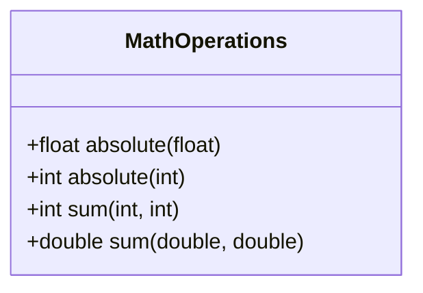

# Function Overloading
Bir sınıf içerisinde birden fazla aynı isimli fonksiyon bulunması durumuna "function overloading" denmektedir.
Bu kapsamda matematik işlemleri yapan aşağıdaki gibi fonksiyonları olan "MathOperations" sınıfını yazın.

* Yukarıdaki verilen fonksiyonların implemente edilmesi durumunda derleyici aşağıdaki gibi bir test kodu yazıldığında hata verir mi?
* Derleyici tarafından verilen hataların nedenlerini yazdığınız kod içerisine yorum satırı olarak yazın.

## Test Kodu

<pre>

int main(void)
{
    int i1 = 20, i2 = -10;
    float f1 = 13.5f, f2 = -9.3f;
    double d1 = 15.3, d2 = 12.8;
    MathOperations mathOp{};

    /* QUESTION: Derleyici hata verdi mi? Verdiyse hatanın açıklamasını yazın. */
    /* Nedenini kendi cümlelerinizle ifade edin */
    cout << "absolute of " << f2 << " is: " << mathOp.absolute(f2) << endl;

    /* QUESTION: Derleyici hata verdi mi? Verdiyse hatanın açıklamasını yazın. */
    /* Nedenini kendi cümlelerinizle ifade edin */
    cout << "absolute of " << i2 << " is: " << mathOp.absolute(i2) << endl;

    /* QUESTION: Derleyici hata verdi mi? Verdiyse hatanın açıklamasını yazın. */
    /* Nedenini kendi cümlelerinizle ifade edin */
    //cout << "absolute of " << d1 << " is: " << mathOp.absolute(d1) << endl;

    /* QUESTION: Derleyici hata verdi mi? Verdiyse hatanın açıklamasını yazın. */
    /* Nedenini kendi cümlelerinizle ifade edin */
    cout << "(" << i1 << ") + " << "(" << i2 << ") = " << mathOp.sum(i1, i2) << endl;

    /* QUESTION: Derleyici hata verdi mi? Verdiyse hatanın açıklamasını yazın. */
    /* Nedenini kendi cümlelerinizle ifade edin */
    cout << "(" << d1 << ") + " << "(" << d2 << ") = " << mathOp.sum(d1, d2) << endl;

    /* QUESTION: Derleyici hata verdi mi? Verdiyse hatanın açıklamasını yazın. */
    /* Nedenini kendi cümlelerinizle ifade edin */
    cout << "(" << f1 << ") + " << "(" << f2 << ") = " << mathOp.sum(f1, f2) << endl;
}

</pre>

## Ödev Teslimi

Ödevi derse katılan herkes kendisi için açılmış olan klasörlere yüklemelidir. **Ödev Teslim Tarihi: 18.03.2020 Saat: 08:00**