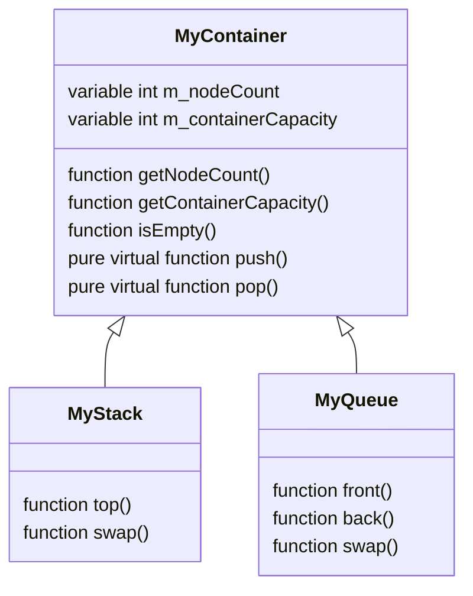

# Containers (Kap Yapıları)

Tipik olarak container lar bir uygulama üzerinde kullanılan dataları belirli bir sırada, hiyerarşide veya düzende tutmaya yarayan veri yapılarıdır. Bu bitirme ödevinde temel abstract bir container sınıfı oluşturulacaktır. Bu sınıf kendi içerisinde bazı değişkenler, fonksiyonlar ve türetme yapıldıktan sonra overload edilecek temel fonksiyonları barındıracaktır. Türetilen sınıf kendi ihtiyacı olan implementasyona göre taban sınıfta verilen fonksiyonların içerisini dolduracaktır.

* **MyContainer\<T\>** diye bir sınıf olsun. Bu sınıf abstract olacaktır.
* Bu sınıf türünden 2 tane kontainer sınıf türetilecektir. Bunlardan biri **MyStack\<T\>**, diğeride **MyQueue\<T\>** olacakır.
* Bu sınıflar generic olacaklardır. T tipi compile time sırasında ne olarak verilirse o türden verileri içerisinde tutacaklardır.

Sınıfların genel yapısı aşağıdaki gibidir.

## MyContainer<T> Sınıfı

| Variables            | Explanation                                                                                                                                                  |
|----------------------|:-------------------------------------------------------------------------------------------------------------------------------------------------------------|
|  int m_nodeCount     | Container sınıfı abstract bir sınıf olmasına rağmen kendinden türetilen sınıfların eleman sayısını tutmak için m_nodeCount değişkenini barındırmaktadır. Bu değişken değeri her yeni bir node oluşturulduğunda türetilen sınıflar tarafından arttırılmalıdır. Bu değer sınıf içerisinde protected olarak tutulmalı ve sınıf dışından getNodeCount public metoduyla erişelebilmelidir. |
| m_containerCapacity  | Container ın mevcut durumda kaç elemana kadar barındırabilmek için dinamik hafıza tahsisatı (dynamic memory allocation) yaptığını tutan değişkendir. Başlangıç değeri 10 olmalıdır. Container da tutulan node sayısı bu değere ulaştığı zaman yeniden 2 kat tahsisat yapılarak daha önce tahsis edilen alanda bulunan node lar yeni alana kopyalanır. Örneğin node sayısı 10'a ulaştığında capacity 20'ye, node sayısı 20'ye ulaştığında capacity 40'a çıkarılır. Bu işlem container her dolduğunda artma sağlanacak şekilde devam ettirilir.|

| Functions              | Explanation                                                                                                                                                  |
|------------------------|:-------------------------------------------------------------------------------------------------------------------------------------------------------------|
|    isEmpty()           | Container ın boş olup olmadığını kontrol eder.                                                                                                               |
|    getNodeCount()      | Container da bulunan node sayısı bilgisini döndürür.                                                                                                         |
| getContainerCapacity() | Container ın kaç eleman alabilecek şekilde dinamik hafıza tahsisatı (dynamic memory allocation) yaptığı bilgisini döndürür.                                  |

## MyStack<T> Sınıfı

| Base Class Functions | Explanation                                                                                                                                                  |
|----------------------|:-------------------------------------------------------------------------------------------------------------------------------------------------------------|
|    push()            | Container a yeni bir eleman ekler. Override edilecektir.                                                                                                     |
|    pop()             | Container a **en son eklenen** elemanı çıkarır. Override edilecektir.                                                                                        |

| Member Functions     | Explanation                                                                                                                                                  |
|----------------------|:-------------------------------------------------------------------------------------------------------------------------------------------------------------|
|    swap()            | *this içerisinde bulunan elemanların hepsini fonsksiyon çağrısında verilen argüman MyStack<T> sınıfı türünden değişken ile takas eder.                       |

| Friend Functions     | Explanation                                                                                                                                                  |
|----------------------|:-------------------------------------------------------------------------------------------------------------------------------------------------------------|
|    operator<<        | Veri yapısı içerisinde bulunan tüm değerleri ekrana yazdırır.                                                                                                |

## MyQueue<T> Sınıfı

| Base Class Functions | Explanation                                                                                                                                                  |
|----------------------|:-------------------------------------------------------------------------------------------------------------------------------------------------------------|
|    push()            | Container a yeni bir eleman ekler. Override edilecektir.                                                                                                     |
|    pop()             | Container a **en ilk eklenen** elemanı çıkarır. Override edilecektir.                                                                                        |

| Member Functions | Explanation                                                                                                                                                      |
|----------------------|:-------------------------------------------------------------------------------------------------------------------------------------------------------------|
|    swap()            | *this içerisinde bulunan elemanların hepsini fonsksiyon çağrısında verilen argüman MyQueue<T> sınıfı türünden değişken ile takas eder.                       |

| Friend Functions     | Explanation                                                                                                                                                  |
|----------------------|:-------------------------------------------------------------------------------------------------------------------------------------------------------------|
|    operator<<        | Veri yapısı içerisinde bulunan tüm değerleri ekrana yazdırır.                                                                                                |

## Ödev Teslimi

Ödevi derse katılan herkes kendisi için açılmış olan klasöre yüklemelidir. **Ödev Teslim Tarihi: 08.05.2020 Saat: 12:00**

