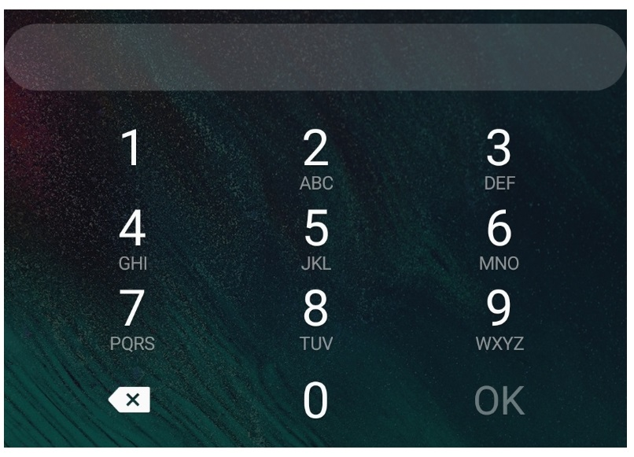

# Geliştirilmiş Line Edit

* QLineEdit kullanılarak yeni bir Line Edit sınıfı oluşturunuz.  
* Bu sınıfı kullanarak Android telefonlarda bulunan tuş takımını temsil eden bir uygulama yazınız.  
* Line Edit e eklene değeri şifreli ve şifresiz gösterebilecek şekilde sınıfa bir özellik ekleyiniz.  
* Line Edit te bulunan text ve display text metodları ile yapılabilir. Her ikiside denenecektir.

## Ödev Teslimi
 
Ödevi derse katılan herkes kendisi için açılmış olan klasöre yüklemelidir. **Ödev Teslim Tarihi: 03.06.2020 Saat: 12:00**