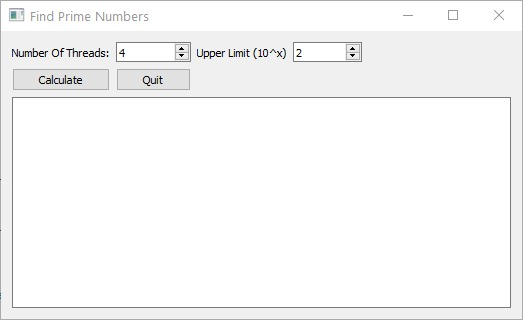

# Asal Sayıları Bulma

* Derste bahsi geçen asal sayıları bulma uygulaması için büyük sayılarda karşılaşılan thread lerin eşit olmayan yük dağılımlarını telafi edecek algoritma değişikliklerini yapın.  
* Asal sayıları bulan worker threadlerde daha büyük sayılar için daha az sayı aralığı olacak şekilde adil bir sayı paylaşımı yapan algoritmayı yazın. Duruma göre threadler aynı sayıda ya da farklı sayıda sayıyı test edebilir.  
* Algoritma değişikliğinden sonra worker thread lerin bitiş süreleri yaklaşık olarak aynı olmalı ve program değişiklikten önceki ilk durumuna göre daha verimli çalışmalıdır.  
* Problem olabildiğince hızlı çözülsün ve threadler birbirlerine yakın zamanda işlerini bitirsinler.  

## Ödev Teslimi

Ödevi derse katılan herkes kendisi için açılmış olan klasöre yüklemelidir.
**Ödev Teslim Tarihi: 17.06.2020 Saat: 12:00**